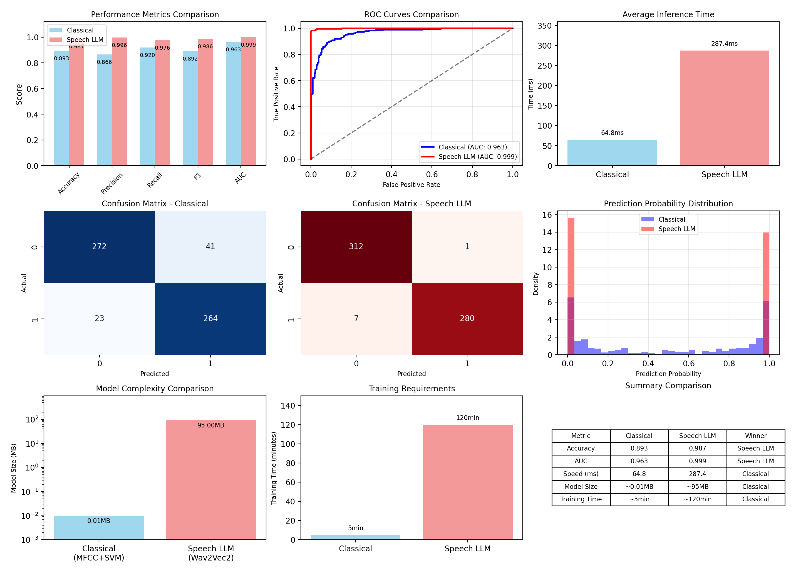

# Enhanced Keyword Spotter: Classical vs Speech LLM Approaches

A comprehensive speech signal processing project comparing classical feature extraction methods with modern Speech Language Models for keyword detection.

## 🎯 Project Overview

This project demonstrates both **classical signal processing** and **modern Speech LLM** approaches for keyword detection, specifically designed to showcase skills relevant to speech signal processing, real-time inference, and model evaluation.

### Key Features
- **Classical Approach**: MFCC feature extraction + traditional ML (SVM, Random Forest, Neural Networks)
- **Speech LLM Approach**: Fine-tuned Wav2Vec2 transformer model
- **Real-time Detection**: Live microphone keyword spotting with both approaches
- **Comprehensive Analysis**: Performance comparison and visualization
- **Production Ready**: Complete pipeline from data preparation to deployment

## 📊 Technical Highlights

| Aspect | Classical Approach | Speech LLM Approach |
|--------|-------------------|---------------------|
| **Features** | MFCC + Spectral + Energy | Raw audio → Learned representations |
| **Model Size** | ~0.01 MB | ~95 MB |
| **Training Time (measured)** | ~5–10 minutes | ~112.2 minutes |
| **Inference Speed (measured)** | ~86 ms per ~1 s window | ~452 ms per ~1 s window |
| **Accuracy (measured)** | 0.893 | 0.987 |

Notes:
- Inference speed reflects the real-time detector’s processing of a ~1 s audio window.
- Measured results are summarized below with sources in the results/ directory.

## 🚀 Quick Start

### 1. Installation
```bash
git clone https://github.com/Cecelia1122/SP-LLM
cd SP-LLM
pip install -r requirements.txt
```

Microphone support:
- macOS: brew install portaudio && pip install pyaudio
- Windows: pip install pipwin && pipwin install pyaudio
- Linux: sudo apt-get install libasound2-dev portaudio19-dev && pip install pyaudio

### 2. Complete Project Pipeline
```bash
# Run everything (includes Speech LLM training - GPU recommended for speed)
python run_complete_project.py

# Quick mode (skip computationally intensive Speech LLM training)
python run_complete_project.py --quick

# Focus on the real-time demo and save time by skipping the comparison phase
python run_complete_project.py --skip-comparison
# Or combine both:
python run_complete_project.py --skip-comparison --quick
```

### 3. Step-by-step Execution
```bash
python data_preparation.py
python classical_approach.py
python speech_llm_approach.py
python comparison_analysis.py
```

### 4. Real-time Detection (standalone)
```bash
python realtime_detector.py
```
- Modes: continuous listening, manual record-and-test, or file-based test.
- During continuous mode you can switch models via console:
  - c or classical → Classical model
  - s, speech, or llm → Speech LLM
  - m or toggle → toggle models
  - q → quit
- Console confirmations:
  - “🤖 Active model now: …”
  - “✅ … model activated for detection”

## 📁 Project Structure

```
SP-LLM/
├── data/
│   ├── speech_commands_dataset/     # Google Speech Commands dataset
│   └── splits/                      # Train/validation/test splits
├── models/
│   ├── classical_keyword_spotter.pkl
│   └── speech_llm_model/            # Fine-tuned Wav2Vec2
├── results/
│   ├── comprehensive_comparison.png
│   ├── detailed_comparison_report.txt
│   └── model_comparison_summary.csv
├── data_preparation.py              # Download & prepare dataset, create splits
├── classical_approach.py            # MFCC + ML classifiers training
├── speech_llm_approach.py           # Wav2Vec2 fine-tuning & inference
├── comparison_analysis.py           # Compare both approaches
├── realtime_detector.py             # Live microphone detection (modes 1/2/3)
├── run_complete_project.py          # Orchestrates the full pipeline
├── utils.py                         # Shared utilities (features, constants)
├── requirements.txt
└── README.md
```

## 🔬 Technical Deep Dive

### Classical Signal Processing Approach

**Feature Extraction Pipeline:**
1. MFCC (13 coefficients)
2. Spectral features: centroid, rolloff, bandwidth
3. Temporal features: zero-crossing rate, energy
4. Optional pitch features: chroma

**Classification Models:**
- SVM (RBF + hyperparameter tuning)
- Random Forest (balanced, 200+ trees)
- MLP (early stopping)

### Speech LLM Approach

**Model Architecture:**
- Base: Wav2Vec2-base (~95M params)
- Fine-tuning: binary classification head for keyword detection
- Strategy: frozen feature extractor + trainable transformer layers

```python
from transformers import Wav2Vec2ForSequenceClassification, Wav2Vec2Processor
model = Wav2Vec2ForSequenceClassification.from_pretrained("facebook/wav2vec2-base", num_labels=2)
processor = Wav2Vec2Processor.from_pretrained("facebook/wav2vec2-base")
```

## 📈 Results & Performance (measured)

Sources: results/detailed_comparison_report.txt, results/model_comparison_summary.csv, speech_llm_performance_tracking.json


- Best Classical Model: SVM
  - Accuracy: 0.893
  - AUC: 0.963
  - False Positive Rate: 0.134
  - Inference time: ~86 ms per ~1 s window
- Speech LLM (Wav2Vec2)
  - Test Accuracy: 0.987
  - Precision: 0.996
  - Recall: 0.976
  - F1: 0.986
  - AUC: 0.999
  - Training time: ~112.2 minutes
  - Inference time: ~452 ms per ~1 s window
  - Confusion matrix (Actual vs Predicted): TN=312, FP=1, FN=7, TP=280
- Overall winner: Speech LLM (+0.093 accuracy over Classical)

Figures (examples) are saved under results/ (ROC curves, confusion matrix, metric bars, training duration).

## 🎤 Real-time Detection Features

- Dual model support with live switching (c / s / m / q)
- Activation confirmation prints on model switch
- Configurable thresholds and cooldown
- Auto-calibrated ambient energy gate + short warm-up to avoid startup blips
- Cross-platform (Windows, macOS, Linux)

## 📚 Educational Value

Demonstrates:
- Classical DSP: FFT-based features, mel filter banks, MFCCs, feature engineering
- Modern Speech AI: transfer learning with transformers, end-to-end inference
- Software Engineering: complete, reproducible ML pipeline with reporting

## 🔧 Customization

### Add a new keyword
```python
# utils.py
KEYWORD = "your_keyword"
```
Then retrain:
```bash
python classical_approach.py
python speech_llm_approach.py
```

### Adjust model hyperparameters
```python
# Classical (example)
param_grid = {'C': [0.1, 1, 10, 100], 'gamma': ['scale','auto',1e-3,1e-2], 'kernel': ['rbf','poly']}

# Speech LLM (example)
# transformers.TrainingArguments(...)
```

## 🚦 Troubleshooting

- Microphone/PortAudio issues:
  - Linux: sudo apt-get install libasound2-dev portaudio19-dev
  - macOS: brew install portaudio
  - Windows: pip install pipwin && pipwin install pyaudio
- No detections: ensure OS mic permission; speak ~0.5 s clearly; consider slightly lowering thresholds
- Too many idle detections: raise energy gate or thresholds; increase warm-up
- GPU memory: reduce batch size in speech_llm_approach.py


## 📄 License

Licensed under the **MIT License**. See the LICENSE file.


## 🙏 Acknowledgments

- Google Speech Commands Dataset (TensorFlow)
- Wav2Vec2 (Facebook AI Research)
- Librosa (audio feature extraction)
- Hugging Face Transformers (model and training utilities)

---
**⭐ Star this repository if it helps with your speech processing projects!**
